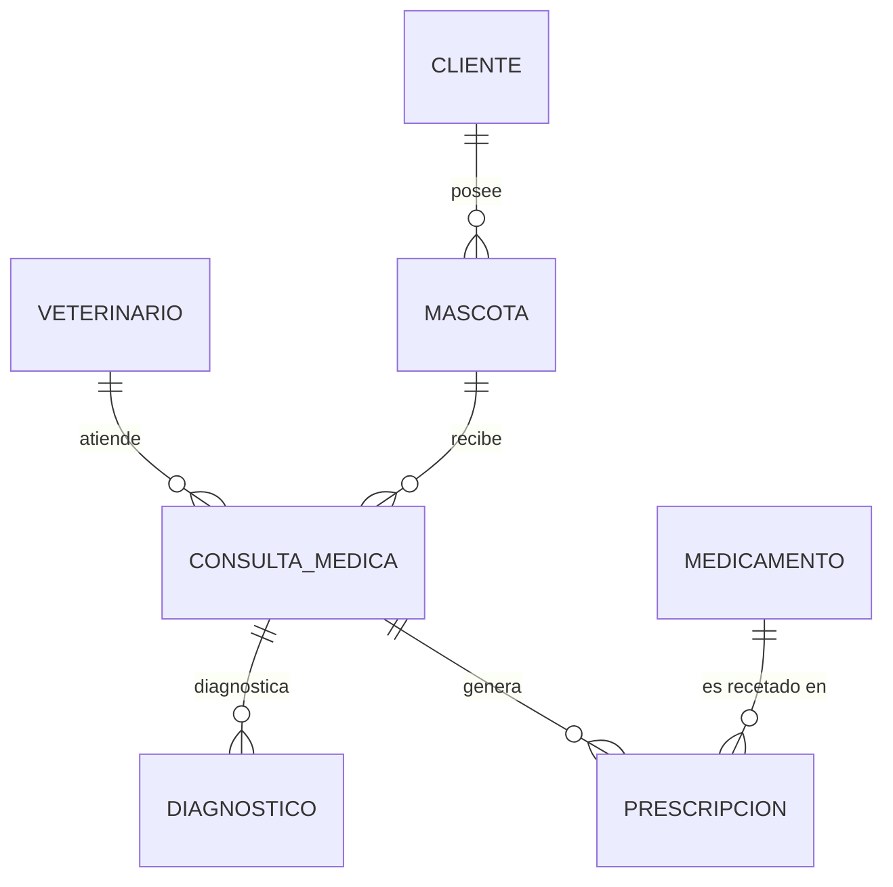

# Veterinaria API

API REST para la gestión de clientes, sus mascotas, veterinarios, medicamentos en farmacia, consultas médicas, diagnósticos y prescripciones con control de inventario, construida con Spring Boot como proyecto del curso de Plataformas.

## Stack

| Componente | Version |
|---|---|
| Java | 25 |
| Spring Boot | 4.1.0 |
| Build | Maven (wrapper incluido) |
| Base de datos | PostgreSQL 18 (local, administrada con pgAdmin 4) |
| ORM | Spring Data JPA / Hibernate |
| Tests | H2 en memoria (aislado de la base real) |

---

## Arquitectura de capas

```
co.edu.upb.veterinaria
├── VeterinariaApplication.java          @SpringBootApplication
├── model
│   ├── Cliente.java                     @Entity (El dueño de la mascota)
│   ├── Mascota.java                     @Entity (@ManyToOne hacia Cliente)
│   ├── Veterinario.java                 @Entity (Personal médico)
│   ├── Medicamento.java                 @Entity (Almacén / Farmacia con stock)
│   ├── ConsultaMedica.java              @Entity (@ManyToOne hacia Mascota y Veterinario)
│   ├── Diagnostico.java                 @Entity (@ManyToOne hacia ConsultaMedica)
│   └── Prescripcion.java                @Entity (@ManyToOne hacia ConsultaMedica y Medicamento)
├── repository
│   ├── ClienteRepository.java            @Repository
│   ├── MascotaRepository.java            @Repository
│   ├── VeterinarioRepository.java        @Repository
│   ├── MedicamentoRepository.java        @Repository
│   ├── ConsultaMedicaRepository.java     @Repository
│   ├── DiagnosticoRepository.java        @Repository
│   └── PrescripcionRepository.java       @Repository
├── service
│   ├── ClienteService.java               @Service (validaciones)
│   ├── MascotaService.java               @Service (validaciones + resuelve Cliente)
│   ├── VeterinarioService.java           @Service (validaciones)
│   ├── MedicamentoService.java           @Service (validaciones)
│   ├── ConsultaMedicaService.java        @Service (validaciones + resuelve Mascota y Veterinario)
│   ├── DiagnosticoService.java           @Service (validaciones + resuelve ConsultaMedica)
│   └── PrescripcionService.java          @Service (deduce stock de Medicamento en PostgreSQL)
├── controller
│   ├── ClienteController.java            @RestController (/api/clientes)
│   ├── MascotaController.java            @RestController (/api/mascotas)
│   ├── VeterinarioController.java        @RestController (/api/veterinarios)
│   ├── MedicamentoController.java        @RestController (/api/medicamentos)
│   ├── ConsultaMedicaController.java     @RestController (/api/consultas)
│   ├── DiagnosticoController.java        @RestController (/api/diagnosticos)
│   ├── PrescripcionController.java       @RestController (/api/prescripciones)
│   └── ManejadorGlobalDeErrores.java     @RestControllerAdvice
└── exception
    └── RecursoNoEncontradoException.java
```

Flujo de una petición: `Controller -> Service -> Repository -> PostgreSQL`.

---

## Modelo Entidad-Relación (ER)



---

## Endpoints

### Clientes — `/api/clientes`

| Método | Ruta | Descripción | Respuesta |
|---|---|---|---|
| `POST` | `/api/clientes` | Crear cliente | `201 CREATED` |
| `GET` | `/api/clientes` | Listar todos | `200 OK` |
| `GET` | `/api/clientes/{id}` | Obtener uno | `200 OK` / `404` |
| `PUT` | `/api/clientes/{id}` | Actualizar | `200 OK` / `404` |
| `DELETE` | `/api/clientes/{id}` | Eliminar | `204 NO CONTENT` / `404` |

### Mascotas — `/api/mascotas`

| Método | Ruta | Descripción | Respuesta |
|---|---|---|---|
| `POST` | `/api/mascotas` | Crear mascota | `201 CREATED` / `404` si el cliente no existe |
| `GET` | `/api/mascotas` | Listar todas | `200 OK` |
| `GET` | `/api/mascotas/{id}` | Obtener una | `200 OK` / `404` |
| `GET` | `/api/mascotas/cliente/{clienteId}` | Mascotas de un dueño | `200 OK` / `404` |
| `PUT` | `/api/mascotas/{id}` | Actualizar | `200 OK` / `404` |
| `DELETE` | `/api/mascotas/{id}` | Eliminar | `204 NO CONTENT` / `404` |

### Veterinarios — `/api/veterinarios`

| Método | Ruta | Descripción | Respuesta |
|---|---|---|---|
| `POST` | `/api/veterinarios` | Registrar médico | `201 CREATED` |
| `GET` | `/api/veterinarios` | Listar todos | `200 OK` |
| `GET` | `/api/veterinarios/{id}` | Obtener uno | `200 OK` / `404` |
| `PUT` | `/api/veterinarios/{id}` | Actualizar | `200 OK` / `404` |
| `DELETE` | `/api/veterinarios/{id}` | Eliminar | `204 NO CONTENT` / `404` |

### Medicamentos — `/api/medicamentos`

| Método | Ruta | Descripción | Respuesta |
|---|---|---|---|
| `POST` | `/api/medicamentos` | Registrar producto | `201 CREATED` |
| `GET` | `/api/medicamentos` | Listar inventario | `200 OK` |
| `GET` | `/api/medicamentos/{id}` | Obtener uno | `200 OK` / `404` |
| `PUT` | `/api/medicamentos/{id}` | Actualizar stock/precio | `200 OK` / `404` |
| `DELETE` | `/api/medicamentos/{id}` | Eliminar | `204 NO CONTENT` / `404` |

### Consultas Médicas — `/api/consultas`

| Método | Ruta | Descripción | Respuesta |
|---|---|---|---|
| `POST` | `/api/consultas` | Crear consulta médica | `201 CREATED` / `404` si mascota o vet no existe |
| `GET` | `/api/consultas` | Listar todas | `200 OK` |
| `GET` | `/api/consultas/{id}` | Obtener una | `200 OK` / `404` |
| `GET` | `/api/consultas/mascota/{mascotaId}` | Historial clínico de una mascota | `200 OK` / `404` |
| `GET` | `/api/consultas/veterinario/{vetId}` | Consultas de un médico | `200 OK` / `404` |
| `PUT` | `/api/consultas/{id}` | Actualizar | `200 OK` / `404` |
| `DELETE` | `/api/consultas/{id}` | Eliminar | `204 NO CONTENT` / `404` |

### Diagnósticos — `/api/diagnosticos`

| Método | Ruta | Descripción | Respuesta |
|---|---|---|---|
| `POST` | `/api/diagnosticos` | Asignar diagnóstico | `201 CREATED` / `404` si consulta no existe |
| `GET` | `/api/diagnosticos` | Listar todos | `200 OK` |
| `GET` | `/api/diagnosticos/{id}` | Obtener uno | `200 OK` / `404` |
| `GET` | `/api/diagnosticos/consulta/{consultaId}` | Diagnósticos de una consulta | `200 OK` / `404` |
| `PUT` | `/api/diagnosticos/{id}` | Actualizar | `200 OK` / `404` |
| `DELETE` | `/api/diagnosticos/{id}` | Eliminar | `204 NO CONTENT` / `404` |

### Prescripciones / Recetas — `/api/prescripciones`

| Método | Ruta | Descripción | Respuesta |
|---|---|---|---|
| `POST` | `/api/prescripciones` | Emitir receta (descuenta stock) | `201 CREATED` / `400` sin stock / `404` |
| `GET` | `/api/prescripciones` | Listar todas | `200 OK` |
| `GET` | `/api/prescripciones/{id}` | Obtener una | `200 OK` / `404` |
| `GET` | `/api/prescripciones/consulta/{consultaId}` | Recetas de una consulta | `200 OK` / `404` |
| `DELETE` | `/api/prescripciones/{id}` | Eliminar receta (devuelve stock) | `204 NO CONTENT` / `404` |

---

## Ejemplos con cURL / Bruno / Postman

1. Crear un cliente:
```bash
curl -i -X POST http://localhost:8080/api/clientes -H "Content-Type: application/json" -d "{\"nombre\":\"Camila Restrepo\",\"telefono\":\"3001234567\",\"email\":\"camila@mail.com\"}"
```

2. Crear una mascota asociada al cliente con id `1`:
```bash
curl -i -X POST http://localhost:8080/api/mascotas -H "Content-Type: application/json" -d "{\"nombre\":\"Firulais\",\"especie\":\"Perro\",\"raza\":\"Labrador\",\"edad\":3,\"cliente\":{\"id\":1}}"
```

3. Registrar un veterinario:
```bash
curl -i -X POST http://localhost:8080/api/veterinarios -H "Content-Type: application/json" -d "{\"nombre\":\"Dr. Carlos Gomez\",\"tarjetaProfesional\":\"TP-88492\",\"especialidad\":\"General\",\"telefono\":\"3109876543\",\"email\":\"carlos@vet.com\"}"
```

4. Registrar un medicamento con stock de `50`:
```bash
curl -i -X POST http://localhost:8080/api/medicamentos -H "Content-Type: application/json" -d "{\"nombre\":\"Amoxicilina 500mg\",\"principioActivo\":\"Amoxicilina\",\"presentacion\":\"Caja x 20\",\"precio\":25000.0,\"stock\":50,\"stockMinimo\":10}"
```

5. Registrar una consulta médica para la mascota `1` atendida por el veterinario `1`:
```bash
curl -i -X POST http://localhost:8080/api/consultas -H "Content-Type: application/json" -d "{\"mascota\":{\"id\":1},\"veterinario\":{\"id\":1},\"motivo\":\"Tos y letargo\",\"pesoKg\":14.2,\"temperaturaC\":39.1,\"observaciones\":\"Congestión\"}"
```

6. Registrar un diagnóstico para la consulta `1`:
```bash
curl -i -X POST http://localhost:8080/api/diagnosticos -H "Content-Type: application/json" -d "{\"consulta\":{\"id\":1},\"descripcion\":\"Tos de las perreras\",\"gravedad\":\"Leve\",\"tratamiento\":\"Antibiótico\"}"
```

7. Emitir receta recetando 14 unidades (descuenta automáticamente el stock en Postgres de 50 a 36):
```bash
curl -i -X POST http://localhost:8080/api/prescripciones -H "Content-Type: application/json" -d "{\"consulta\":{\"id\":1},\"medicamento\":{\"id\":1},\"dosis\":\"1 tab c/12h\",\"duracion\":\"7 días\",\"cantidad\":14}"
```

---

## Base de datos

La app se conecta a PostgreSQL local (`application.yaml`):

| Campo | Valor |
|---|---|
| Host | `localhost:5432` |
| Base de datos | `VeterinariaS` |
| Usuario | `postgres` |
| Contraseña | `1234` |

### Preparación antes de correr el proyecto (una sola vez)

1. Instalar **PostgreSQL** (probado con la versión 18) y **pgAdmin 4**.
2. Asegurarse de que el rol `postgres` tenga la contraseña **`1234`**.
3. Crear una base de datos llamada exactamente **`VeterinariaS`**.

Las **tablas** no hay que crearlas a mano: Hibernate las genera solas la primera vez que la app arranca (`ddl-auto: update`).

Los tests **no** usan esta base — corren contra H2 en memoria (`src/test/resources/application.yaml`), así que `mvnw test` no requiere tener Postgres corriendo ni deja datos de prueba en `VeterinariaS`.

---

## Cómo ejecutar

Requiere JDK 25 y PostgreSQL corriendo localmente con la base `VeterinariaS` creada.

```bash
./mvnw spring-boot:run
```

En Windows:

```cmd
mvnw.cmd spring-boot:run
```

La aplicación queda en `http://localhost:8080`.

## Tests

```cmd
mvnw.cmd test
```
